# `crates/chicago-tdd-tools/src/core/verification_pipeline.rs`

Source SHA-256: `565ed8b2f4cb8f0b44845ca4de8850382c4d7200a9f14406295389c3aa7496f5`

```mermaid
classDiagram
    class enum_PipelinePhase {
      <<enum>>
    }
    class struct_PipelineResult {
      <<struct>>
      +"phase: PipelinePhase"
      +"duration: Duration"
      +"receipt: Option~TestReceipt~"
      +"approved: bool"
      +"metrics: PipelineMetrics"
    }
    class struct_PipelineMetrics {
      <<struct>>
      +"contracts_validated: usize"
      +"thermal_tests_executed: usize"
      +"effect_violations: usize"
      +"state_transitions: usize"
      +"receipts_generated: usize"
      +"average_tau: f64"
      +"max_tau: u64"
      +"tests_suggested: usize"
    }
    class struct_PipelineConfig {
      <<struct>>
      +"thermal_config: HotPathConfig"
      +"require_signatures: bool"
      +"fail_on_tau_violation: bool"
      +"fail_on_effect_violation: bool"
      +"governance_threshold: f64"
    }
    class struct_VerificationPipeline {
      <<struct>>
      +"config: PipelineConfig"
      +"contract_registry: TestContractRegistry"
      +"receipt_registry: TestReceiptRegistry"
      +"orchestrator: TestOrchestrator"
      +"metrics: PipelineMetrics"
    }
    class struct_DeploymentDecision {
      <<struct>>
      +"approved: bool"
      +"tau_violations: usize"
      +"failed_tests: usize"
      +"total_tests: usize"
      +"passing_ratio: f64"
      +"average_tau: f64"
      +"max_tau: u64"
    }
    class mod_tests {
      <<mod>>
    }
    note "Default for PipelineConfig"
    note "DeploymentDecision"
    note "PipelineConfig"
    note "VerificationPipeline"
```

## Dependencies

- `crate::alert_info`
- `crate::core::contract::{TestContract, TestContractRegistry}`
- `crate::core::receipt::{TestOutcome, TestReceipt, TestReceiptRegistry, TimingMeasurement}`
- `crate::swarm::test_orchestrator::{QoSClass, ResourceBudget, TestOrchestrator, TestPlan}`
- `crate::validation::thermal::{HotPathConfig, HotPathTest, ThermalTestError}`
- `std::collections::HashMap`
- `std::time::{Duration, Instant}`
- `super::*`

## Standing

- Structural parse: `ALIVE`
- Runtime behavior: `UNKNOWN`
