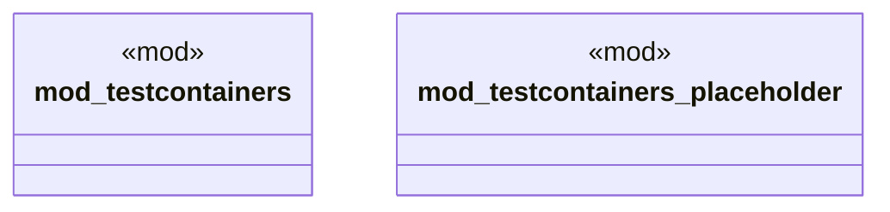

# `crates/chicago-tdd-tools/src/integration/mod.rs`

Source SHA-256: `797ccfe9bc26b4305e921346fa05bbeb7bf698b620a38aea3eaa4b9542cdbb4d`

## Dependencies

- `testcontainers::*`

## Standing

- Structural parse: `ALIVE`
- Runtime behavior: `UNKNOWN`
