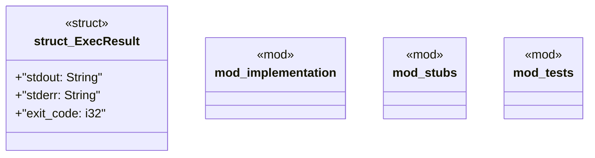

# `crates/chicago-tdd-tools/src/integration/testcontainers/exec.rs`

Source SHA-256: `7526c04f7c914859f27c841ec9bf9c483f81aac182b440e677b638c81b4b32ef`

## Dependencies

- `crate::integration::testcontainers::GenericContainer`
- `crate::integration::testcontainers::implementation::GenericContainer`
- `crate::integration::testcontainers::{ContainerClient, GenericContainer}`
- `crate::test`
- `std::io::Read`
- `std::process::Command`
- `super::*`
- `super::{ExecResult, TestcontainersError, TestcontainersResult}`
- `super::{TestcontainersError, TestcontainersResult}`
- `testcontainers::core::ExecCommand`

## Standing

- Structural parse: `ALIVE`
- Runtime behavior: `UNKNOWN`
