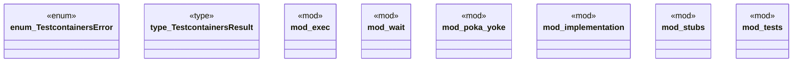

# `crates/chicago-tdd-tools/src/integration/testcontainers/mod.rs`

Source SHA-256: `7339f30da34e8fbe2f9141302c28d68041d255a298944ade28b17e6c98b6fbb0`

## Dependencies

- `crate::assert_eq_msg`
- `crate::assertions::assert_that_with_msg`
- `crate::test`
- `exec::ExecResult`
- `implementation::*`
- `std::collections::HashMap`
- `std::process::Command`
- `std::sync::mpsc`
- `std::thread`
- `std::time::Duration`
- `std::time::Instant`
- `stubs::*`
- `super::*`
- `super::implementation::check_docker_available`
- `super::{HashMap, TestcontainersError, TestcontainersResult}`
- `testcontainers::Container`
- `testcontainers::GenericImage`
- `testcontainers::ImageExt`
- `testcontainers::core::ContainerPort`
- `testcontainers::runners::SyncRunner`
- `thiserror::Error`

## Standing

- Structural parse: `ALIVE`
- Runtime behavior: `UNKNOWN`
