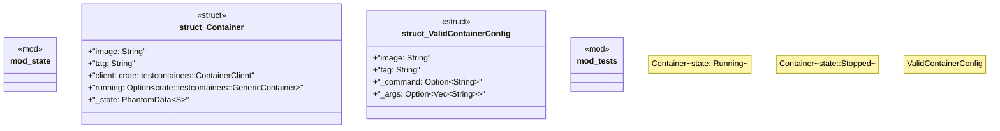

# `crates/chicago-tdd-tools/src/integration/testcontainers/poka_yoke.rs`

Source SHA-256: `dbcd5d8ed819162429c813944becc4771e49fef23ba8d450865caf71b517e226`

## Dependencies

- `std::marker::PhantomData`
- `super::*`

## Standing

- Structural parse: `ALIVE`
- Runtime behavior: `UNKNOWN`
