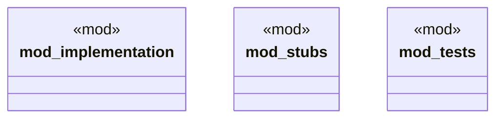

# `crates/chicago-tdd-tools/src/integration/testcontainers/wait.rs`

Source SHA-256: `8ac2e3e0c7533eec96ab7d112110721dce6f53e09d8234cbc3265cf7fc6342ac`

## Dependencies

- `crate::integration::testcontainers::implementation::{ContainerClient, GenericContainer}`
- `crate::integration::testcontainers::{ContainerClient, GenericContainer}`
- `crate::test`
- `super::*`
- `super::{TestcontainersError, TestcontainersResult}`
- `testcontainers::GenericImage`
- `testcontainers::core::WaitFor`
- `testcontainers::runners::SyncRunner`

## Standing

- Structural parse: `ALIVE`
- Runtime behavior: `UNKNOWN`
