# `crates/chicago-tdd-tools/src/lib.rs`

Source SHA-256: `bb42152f50fb87319b5321e41251345ac812c1d9296a3a55fc006b5446677f88`

```mermaid
classDiagram
    class mod_cli_proof {
      <<mod>>
    }
    class mod_core {
      <<mod>>
    }
    class mod_integration {
      <<mod>>
    }
    class mod_observability {
      <<mod>>
    }
    class mod_operator_registry {
      <<mod>>
    }
    class mod_sector_stacks {
      <<mod>>
    }
    class mod_swarm {
      <<mod>>
    }
    class mod_testing {
      <<mod>>
    }
    class mod_validation {
      <<mod>>
    }
    class mod_macros {
      <<mod>>
    }
    class mod_prelude {
      <<mod>>
    }
    class mod___runtime {
      <<mod>>
    }
```

## Dependencies

- `chicago_tdd_tools_proc_macros::TestBuilder`
- `chicago_tdd_tools_proc_macros::chicago_test`
- `chicago_tdd_tools_proc_macros::fixture`
- `chicago_tdd_tools_proc_macros::scaffold`
- `chicago_tdd_tools_proc_macros::tdd_test`
- `core::assertions::{AssertionBuilder, ValidatedAssertion}`
- `core::async_fixture`
- `core::builders::{GenericTestDataBuilder, ValidatedTestDataBuilder}`
- `core::{ alert, assertions, builders, const_assert, fail_fast, fixture, governance, invariants, state, }`
- `crate::cli_proof::{ CliHarness, CliOutput, ReceiptAssertions, SabotageFixture, TempWorkspace, }`
- `crate::core::assertions::*`
- `crate::core::builders::*`
- `crate::core::fixture::*`
- `crate::core::governance::*`
- `crate::core::state::*`
- `crate::core::{ alert, assertions, async_fixture, builders, const_assert, contract, fail_fast, fixture, governance, invariants, receipt, state, test_utils, type_level, verification_pipeline, }`
- `crate::integration::testcontainers::{ ContainerClient, ExecResult, GenericContainer, TestcontainersError, TestcontainersResult, }`
- `crate::observability::otel::{ MetricValidator, OtelValidationError, OtelValidationResult, SpanValidator, }`
- `crate::observability::weaver::{WeaverValidationError, WeaverValidationResult}`
- `crate::observability::{ObservabilityError, ObservabilityResult, ObservabilityTest}`
- `crate::swarm::test_orchestrator::*`
- `crate::testing::cli::*`
- `crate::testing::concurrency::*`
- `crate::testing::effects::*`
- `crate::testing::mutation::*`
- `crate::testing::property::*`
- `crate::testing::snapshot::*`
- `crate::testing::state_machine::*`
- `crate::validation::*`
- `crate::{ alert_critical, alert_debug, alert_info, alert_success, alert_warning, assert_eq_msg, assert_err, assert_fail, assert_guard_constraint, assert_in_range, assert_ok, assert_within_tick_budget, async_test, fixture_test, performance_test, source_location, test, }`
- `integration::testcontainers`
- `observability::otel`
- `observability::weaver::types::WeaverLiveCheck`
- `observability::weaver::{WeaverValidationError, WeaverValidationResult}`
- `observability::{ObservabilityError, ObservabilityResult, ObservabilityTest}`
- `operator_registry::{ global_registry, GuardType, OperatorDescriptor, OperatorProperties, OperatorRegistry, }`
- `rstest`
- `sector_stacks::{academic, claims, OperationReceipt, OperationStatus, SectorOperation}`
- `std::panic::UnwindSafe`
- `swarm::{ ComposedOperation, OperationChain, SwarmCoordinator, SwarmMember, TaskReceipt, TaskRequest, TaskStatus, }`
- `testing::cli`
- `testing::concurrency`
- `testing::snapshot`
- `testing::{generator, mutation, property}`
- `validation::coverage::{CoveragePercentage, CoveredCount, TotalCount}`
- `validation::jtbd::ScenarioIndex`
- `validation::performance::ValidatedTickBudget`
- `validation::{coverage, guards, jtbd, performance}`

## Standing

- Structural parse: `ALIVE`
- Runtime behavior: `UNKNOWN`
