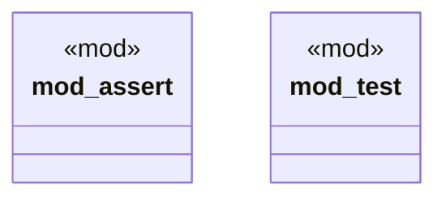

# `crates/chicago-tdd-tools/src/macros.rs`

Source SHA-256: `8877054ab1a7b134ef432e785247e3a07f5634c7195af7af378a301479bad788`

## Dependencies

- `crate::core::macros::assert::*`
- `crate::core::macros::test::*`

## Standing

- Structural parse: `ALIVE`
- Runtime behavior: `UNKNOWN`
