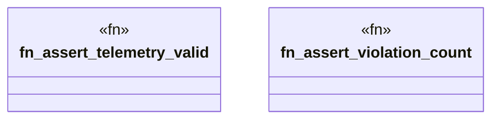

# `crates/chicago-tdd-tools/src/observability/fixtures/assertions.rs`

Source SHA-256: `d52ba0c054e7d343b7583034299c98693add606e7bef1e2395b65087c103c2d2`

## Dependencies

- `crate::observability::{ObservabilityError, ObservabilityResult}`
- `super::ValidationResults`

## Standing

- Structural parse: `ALIVE`
- Runtime behavior: `UNKNOWN`
