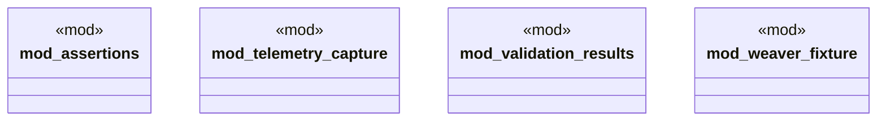

# `crates/chicago-tdd-tools/src/observability/fixtures/mod.rs`

Source SHA-256: `98cafed3ee5f9f42245a4a6c72163daf7252d60ca4e784596eeab5b7cbf23e15`

## Dependencies

- `assertions::*`
- `telemetry_capture::*`
- `validation_results::*`
- `weaver_fixture::*`

## Standing

- Structural parse: `ALIVE`
- Runtime behavior: `UNKNOWN`
