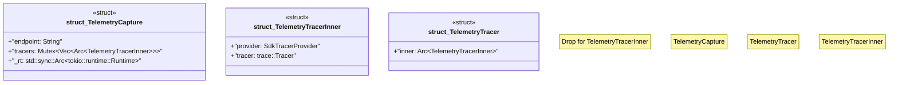

# `crates/chicago-tdd-tools/src/observability/fixtures/telemetry_capture.rs`

Source SHA-256: `850f0fa92527b502d3bd50e24441e30b0a95dadb54af96b1b23d93292198f14b`

## Dependencies

- `crate::observability::{ObservabilityError, ObservabilityResult}`
- `opentelemetry::trace::TracerProvider as _`
- `opentelemetry_otlp::WithExportConfig`
- `opentelemetry_sdk::{ resource::Resource, trace::{self, SdkTracerProvider}, }`
- `std::sync::{Arc, Mutex}`

## Standing

- Structural parse: `ALIVE`
- Runtime behavior: `UNKNOWN`
