# `crates/chicago-tdd-tools/src/observability/fixtures/validation_results.rs`

Source SHA-256: `b6aa53bc1142ccf33ab0e83056294ca7663d02d00e778d092ecc92b1cb9595ef`

```mermaid
classDiagram
    class struct_ValidationResults {
      <<struct>>
      +"advices: Vec~LiveCheckAdvice~"
      +"statistics: Option~LiveCheckStatistics~"
      +"report_path: PathBuf"
    }
    class struct_LiveCheckResult {
      <<struct>>
      +"all_advice: Vec~RawAdvice~"
    }
    class struct_RawAdvice {
      <<struct>>
      +"advice_level: AdviceLevel"
      +"advice_type: String"
      +"message: String"
      +"signal_type: Option~String~"
      +"signal_name: Option~String~"
      +"advice_context: serde_json::Value"
    }
    class struct_LiveCheckAdvice {
      <<struct>>
      +"level: AdviceLevel"
      +"advice_type: String"
      +"message: String"
      +"signal_type: Option~String~"
      +"signal_name: Option~String~"
      +"context: serde_json::Value"
    }
    class struct_LiveCheckStatistics {
      <<struct>>
      +"advice_level_counts: serde_json::Value"
      +"advice_type_counts: serde_json::Value"
      +"highest_advice_level_counts: serde_json::Value"
      +"no_advice_count: Option~u64~"
      +"total_advisories: Option~u64~"
      +"total_entities: Option~u64~"
      +"total_entities_by_type: serde_json::Value"
      +"registry_coverage: Option~f64~"
    }
    class enum_AdviceLevel {
      <<enum>>
    }
    note "Display for AdviceLevel"
    note "From~RawAdvice~ for LiveCheckAdvice"
    note "LiveCheckAdvice"
    note "ValidationResults"
```

## Dependencies

- `crate::observability::{ObservabilityError, ObservabilityResult}`
- `serde::Deserialize`
- `serde_json::{self, Value}`
- `std::fmt::{self, Display}`
- `std::fs::File`
- `std::io::{BufRead, BufReader}`
- `std::path::{Path, PathBuf}`

## Standing

- Structural parse: `ALIVE`
- Runtime behavior: `UNKNOWN`
