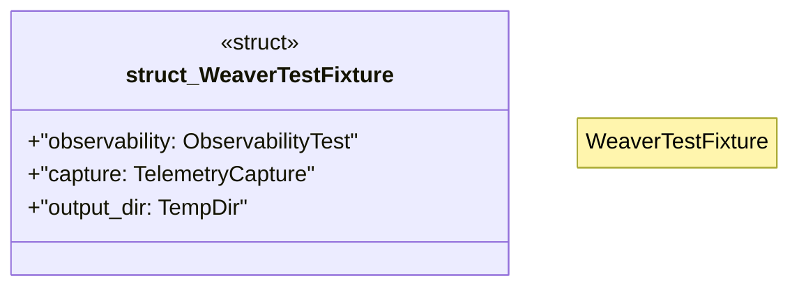

# `crates/chicago-tdd-tools/src/observability/fixtures/weaver_fixture.rs`

Source SHA-256: `94b46df16faa08764059cf0c3aeaff4fd2bbc9eb50911d385abbf232fbb14e5a`

## Dependencies

- `crate::observability::unified::TestConfig`
- `crate::observability::{ObservabilityError, ObservabilityResult, ObservabilityTest}`
- `std::path::Path`
- `std::sync::{Arc, Mutex}`
- `super::{TelemetryCapture, TelemetryTracer, ValidationResults}`
- `tempfile::TempDir`

## Standing

- Structural parse: `ALIVE`
- Runtime behavior: `UNKNOWN`
