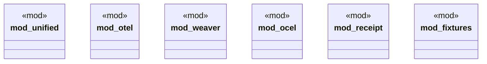

# `crates/chicago-tdd-tools/src/observability/mod.rs`

Source SHA-256: `94ecc1a10ba04af21c64f206be295906666f9339cf5348b538bd26ff4959f34d`

## Dependencies

- `unified::{ObservabilityError, ObservabilityResult, ObservabilityTest, TestConfig}`

## Standing

- Structural parse: `ALIVE`
- Runtime behavior: `UNKNOWN`
