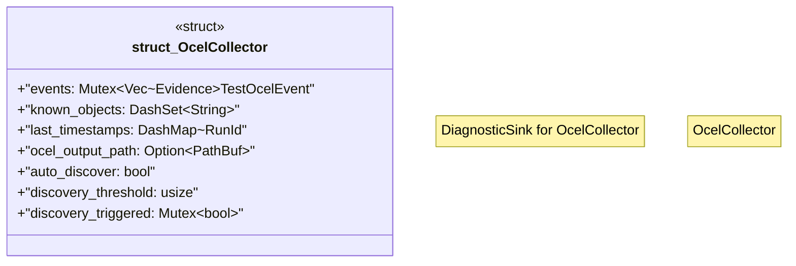

# `crates/chicago-tdd-tools/src/observability/ocel/collector.rs`

Source SHA-256: `9d80b9e9c6201faa4a6b81a9f61e9995ce7f05e45b71a82303c73e6fae7184b1`

## Dependencies

- `crate::core::governance::{ ContributionKind, Diagnostic, DiagnosticSink, RunId, RunSummary, SubstrateDelta, }`
- `crate::observability::ocel::types::{TestActivity, TestObjectType, TestOcelEvent}`
- `crate::observability::ocel::wasm4pm::{seal_run, TestSuiteWitness}`
- `dashmap::{DashMap, DashSet}`
- `std::collections::HashMap`
- `std::path::PathBuf`
- `std::sync::Mutex`
- `wasm4pm_compat::{Admitted, Evidence, Raw}`

## Standing

- Structural parse: `ALIVE`
- Runtime behavior: `UNKNOWN`
