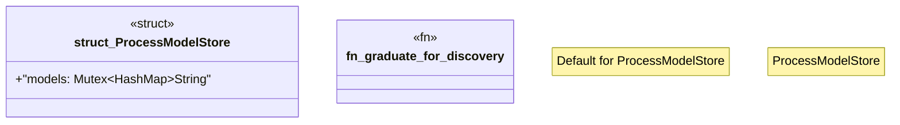

# `crates/chicago-tdd-tools/src/observability/ocel/discovery.rs`

Source SHA-256: `3fe7f140d166fdad75cedc9ebbbf78526ad1bc89ce733ec550ae787c67887d26`

## Dependencies

- `crate::observability::ocel::types::OcelLog`
- `crate::observability::ocel::wasm4pm::TestSuiteWitness`
- `std::collections::HashMap`
- `std::sync::Mutex`
- `wasm4pm_compat::engine_bridge::{GraduationCandidate, GraduationReason}`
- `wasm4pm_compat::{Evidence, Receipted}`

## Standing

- Structural parse: `ALIVE`
- Runtime behavior: `UNKNOWN`
