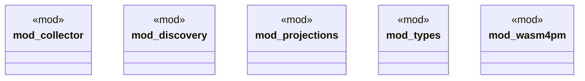

# `crates/chicago-tdd-tools/src/observability/ocel/mod.rs`

Source SHA-256: `772f92f1da8b80f0ef932b22f707247814de04cf07d05cb817fac57b3d41331f`

## Dependencies

- `collector::OcelCollector`
- `types::*`

## Standing

- Structural parse: `ALIVE`
- Runtime behavior: `UNKNOWN`
