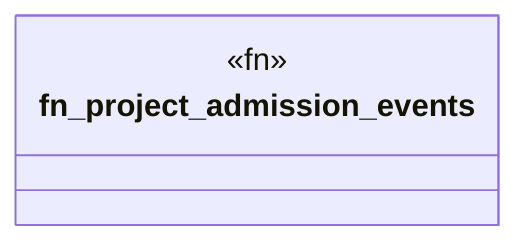

# `crates/chicago-tdd-tools/src/observability/ocel/projections.rs`

Source SHA-256: `84747e4a641d05facef8c69f151c287433a26cf76ec64d0c5c0050e2a6a195b3`

## Dependencies

- `crate::observability::ocel::types::OcelLog`
- `crate::observability::ocel::wasm4pm::TestSuiteWitness`
- `wasm4pm_compat::{Admitted, Evidence}`

## Standing

- Structural parse: `ALIVE`
- Runtime behavior: `UNKNOWN`
