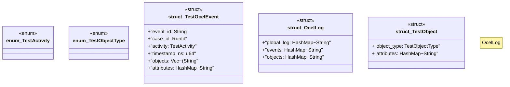

# `crates/chicago-tdd-tools/src/observability/ocel/types.rs`

Source SHA-256: `e67eadcdfe66a67f1d99574ba49555f4e90c541343a0ffd32571f020af33543f`

## Dependencies

- `crate::core::governance::{DiagnosticCategory, RunId, Severity}`
- `serde::{Deserialize, Serialize}`
- `std::collections::HashMap`

## Standing

- Structural parse: `ALIVE`
- Runtime behavior: `UNKNOWN`
