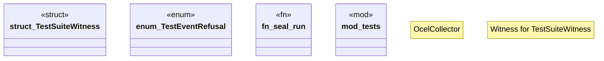

# `crates/chicago-tdd-tools/src/observability/ocel/wasm4pm.rs`

Source SHA-256: `eae3dd732c0e79c4d37e0495abc0fa494fa151c0696adcd5ad539304926f36b5`

## Dependencies

- `crate::core::governance::RunId`
- `crate::observability::ocel::collector::OcelCollector`
- `crate::observability::ocel::types::TestActivity`
- `crate::observability::ocel::types::{OcelLog, TestOcelEvent}`
- `std::collections::HashMap`
- `std::fmt::Write as _`
- `super::*`
- `wasm4pm_compat::admission::Admission`
- `wasm4pm_compat::{Admitted, Evidence, Raw, Receipted, Witness, WitnessFamily}`

## Standing

- Structural parse: `ALIVE`
- Runtime behavior: `UNKNOWN`
