# `crates/chicago-tdd-tools/src/observability/otel/mod.rs`

Source SHA-256: `9cbb6685eb840e5a9bd3c05c20808060f8dcd22348949db4a8d1dbd71cb5eab7`

```mermaid
classDiagram
    class mod_types {
      <<mod>>
    }
    class mod_poka_yoke {
      <<mod>>
    }
    class enum_OtelValidationError {
      <<enum>>
    }
    class type_OtelValidationResult {
      <<type>>
    }
    class struct_SpanValidator {
      <<struct>>
      +"required_attributes: Vec~String~"
      +"validate_non_zero_ids: bool"
    }
    class struct_MetricValidator {
      <<struct>>
      +"required_attributes: Vec~String~"
    }
    class struct_OtelTestHelper {
      <<struct>>
      +"span_validator: SpanValidator"
      +"metric_validator: MetricValidator"
    }
    class mod_test_helpers {
      <<mod>>
    }
    class mod_tests {
      <<mod>>
    }
    note "Default for MetricValidator"
    note "Default for OtelTestHelper"
    note "Default for SpanValidator"
    note "MetricValidator"
    note "OtelTestHelper"
    note "SpanValidator"
```

## Dependencies

- `crate::observability::otel::types::MetricValue`
- `crate::observability::otel::types::{ Attributes, Metric, MetricValue, Span, SpanContext, SpanId, SpanStatus, TraceId, }`
- `crate::observability::otel::types::{Metric, Span, SpanId}`
- `crate::observability::otel::types::{SpanContext, SpanId, SpanStatus, TraceId}`
- `super::*`
- `thiserror::Error`

## Standing

- Structural parse: `ALIVE`
- Runtime behavior: `UNKNOWN`
