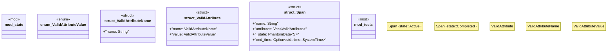

# `crates/chicago-tdd-tools/src/observability/otel/poka_yoke.rs`

Source SHA-256: `987ed129394486945a966e05f8ad1e2e8953a286e6b1c54a66e1e94f04a43bdf`

## Dependencies

- `std::marker::PhantomData`
- `super::*`

## Standing

- Structural parse: `ALIVE`
- Runtime behavior: `UNKNOWN`
