# `crates/chicago-tdd-tools/src/observability/otel/types.rs`

Source SHA-256: `487ec7718200f33108ba8354881b7eb1386963b17360988340d1e58a60e47ca8`

```mermaid
classDiagram
    class struct_TraceId {
      <<struct>>
    }
    class struct_SpanId {
      <<struct>>
    }
    class enum_SpanRelationship {
      <<enum>>
    }
    class struct_SpanContext {
      <<struct>>
      +"trace_id: TraceId"
      +"span_id: SpanId"
      +"relationship: SpanRelationship"
      +"flags: u8"
    }
    class type_Attributes {
      <<type>>
    }
    class struct_SpanEvent {
      <<struct>>
      +"name: String"
      +"timestamp_ms: u64"
      +"attributes: Attributes"
    }
    class enum_SpanStatus {
      <<enum>>
    }
    class enum_SpanState {
      <<enum>>
    }
    class struct_Span {
      <<struct>>
      +"context: SpanContext"
      +"name: String"
      +"state: SpanState"
      +"attributes: Attributes"
      +"events: Vec~SpanEvent~"
      +"status: SpanStatus"
    }
    class enum_MetricValue {
      <<enum>>
    }
    class struct_Metric {
      <<struct>>
      +"name: String"
      +"value: MetricValue"
      +"timestamp_ms: u64"
      +"attributes: Attributes"
    }
    class mod_tests {
      <<mod>>
    }
    note "Span"
    note "SpanContext"
    note "SpanRelationship"
    note "SpanState"
```

## Dependencies

- `std::collections::BTreeMap`
- `super::*`

## Standing

- Structural parse: `ALIVE`
- Runtime behavior: `UNKNOWN`
