# `crates/chicago-tdd-tools/src/observability/receipt.rs`

Source SHA-256: `9d777f43d8457feffe41f9b0cda514bc6097361e208697be73d88844c24b39ed`

```mermaid
classDiagram
    class trait_Blake3ReceiptEntry {
      <<trait>>
      +"prev_hash(&self) -~ [u8"
      +"content_bytes(&self) -~ Vec~u8~"
      +"stored_hash(&self) -~ [u8"
      +"replay_ptr(&self) -~ Option~u64~"
    }
    class enum_ChainError {
      <<enum>>
    }
    class fn_hex_encode {
      <<fn>>
    }
    class struct_Blake3ChainValidator {
      <<struct>>
    }
    class struct_RawReceiptEntry {
      <<struct>>
      +"prev: [u8; 32]"
      +"run_id_le: [u8; 8]"
      +"op_trace_le: [u8; 8]"
      +"topo_tag: u8"
      +"chain_hash: [u8; 32]"
      +"replay_ptr_bytes: [u8; 8]"
    }
    class struct_ReceiptChainBuilder {
      <<struct>>
      +"entries: Vec~RawReceiptEntry~"
      +"prev_hash: [u8; 32]"
    }
    note "Blake3ChainValidator"
    note "Blake3ReceiptEntry for RawReceiptEntry"
    note "Default for ReceiptChainBuilder"
    note "RawReceiptEntry"
    note "ReceiptChainBuilder"
    note "std::fmt::Display for ChainError"
```

## Dependencies

- `std::fmt::Write as _`

## Standing

- Structural parse: `ALIVE`
- Runtime behavior: `UNKNOWN`
