# `crates/chicago-tdd-tools/src/observability/unified.rs`

Source SHA-256: `cd8db291926e92f35d9704cc5159800d45ff50dce41661f560345c1c2f3634e7`

```mermaid
classDiagram
    class enum_ObservabilityError {
      <<enum>>
    }
    class type_ObservabilityResult {
      <<type>>
    }
    class type_ObservabilityResult {
      <<type>>
    }
    class struct_ValidationState {
      <<struct>>
      +"compile_time_validated: bool"
      +"runtime_validated: bool"
    }
    class struct_TestConfig {
      <<struct>>
      +"registry_path: Option~PathBuf~"
      +"otlp_grpc_port: u16"
      +"admin_port: u16"
      +"weaver_enabled: bool"
      +"compile_time_validation: bool"
      +"weaver_output_dir: Option~PathBuf~"
    }
    class struct_ObservabilityTest {
      <<struct>>
      +"otel_validator: OtelValidator"
      +"weaver_validator: Option~WeaverValidator~"
      +"config: TestConfig"
      +"weaver_process: Option~Child~"
      +"weaver_output_dir: Option~PathBuf~"
      +"validation_results: Option~ValidationResults~"
      +"_validation_state: PhantomData~ValidationState~"
    }
    class struct_OtelValidator {
      <<struct>>
    }
    class struct_WeaverValidator {
      <<struct>>
      +"live_check: Option~crate::observability::weaver::types::WeaverLiveCheck~"
    }
    class mod_tests {
      <<mod>>
    }
    note "Default for TestConfig"
    note "Drop for ObservabilityTest"
    note "ObservabilityTest"
    note "OtelValidator"
    note "WeaverValidator"
```

## Dependencies

- `crate::observability::fixtures::ValidationResults`
- `crate::observability::otel::types::MetricValue`
- `crate::observability::otel::types::{Metric, Span}`
- `crate::observability::otel::types::{SpanContext, SpanId, SpanStatus, TraceId}`
- `crate::observability::weaver::types::WeaverLiveCheck`
- `std::marker::PhantomData`
- `std::path::PathBuf`
- `std::process::Child`
- `std::process::Command`
- `super::*`
- `thiserror::Error`

## Standing

- Structural parse: `ALIVE`
- Runtime behavior: `UNKNOWN`
