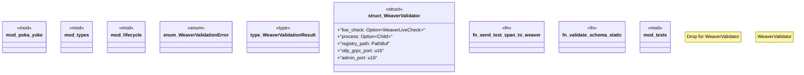

# `crates/chicago-tdd-tools/src/observability/weaver/mod.rs`

Source SHA-256: `92b67f19af472a3790ae9df0cba46a59813c31650e5bf512fa0f44034dbbee50`

## Dependencies

- `crate::assert_err`
- `crate::observability::weaver::WeaverValidationError`
- `crate::observability::weaver::types::WeaverLiveCheck`
- `crate::testcontainers::check_docker_available`
- `opentelemetry::KeyValue`
- `opentelemetry::trace::{Span, Tracer, TracerProvider as _}`
- `opentelemetry_sdk::Resource`
- `opentelemetry_sdk::trace::{RandomIdGenerator, Sampler, SdkTracerProvider}`
- `std::marker::PhantomData`
- `std::path::PathBuf`
- `std::path::{Path, PathBuf}`
- `std::process::Child`
- `std::process::Command`
- `std::time::Duration`
- `super::*`
- `thiserror::Error`

## Standing

- Structural parse: `ALIVE`
- Runtime behavior: `UNKNOWN`
