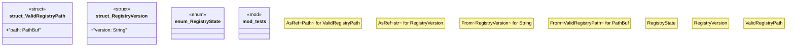

# `crates/chicago-tdd-tools/src/observability/weaver/poka_yoke.rs`

Source SHA-256: `80977a536f727a0b7b26a30df7cbf3530d552508a355d0227674ba051533b9bc`

## Dependencies

- `std::fs`
- `std::path::{Path, PathBuf}`
- `super::*`
- `tempfile::TempDir`

## Standing

- Structural parse: `ALIVE`
- Runtime behavior: `UNKNOWN`
