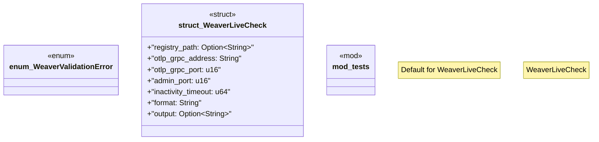

# `crates/chicago-tdd-tools/src/observability/weaver/types.rs`

Source SHA-256: `7c3d98e2881f7be53d439f20623ea1ada04691b87b65efc7f4373b7896404e81`

## Dependencies

- `std::env`
- `std::fs`
- `std::io::{Read, Write}`
- `std::net::{TcpStream, ToSocketAddrs}`
- `std::os::unix::fs::PermissionsExt`
- `std::path::PathBuf`
- `std::process::Child`
- `std::process::Command`
- `std::time::Duration`
- `std::time::Instant`
- `super::*`
- `thiserror::Error`

## Standing

- Structural parse: `ALIVE`
- Runtime behavior: `UNKNOWN`
