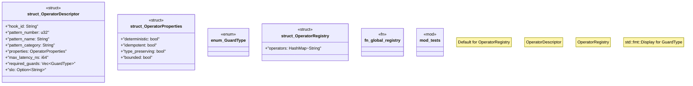

# `crates/chicago-tdd-tools/src/operator_registry.rs`

Source SHA-256: `f397370e4535e1e12aec338509008920861a2f0460aa41851f4454af5968a8db`

## Dependencies

- `serde::{Deserialize, Serialize}`
- `std::collections::HashMap`
- `std::sync::OnceLock`
- `super::*`

## Standing

- Structural parse: `ALIVE`
- Runtime behavior: `UNKNOWN`
