# `crates/chicago-tdd-tools/src/sector_stacks/academic.rs`

Source SHA-256: `aca6aba3293d69c65112682c24039b89cfe5e85e17d8c677fadf9fd463b1dba6`

```mermaid
classDiagram
    class struct_PaperSubmission {
      <<struct>>
      +"paper_id: String"
      +"title: String"
      +"authors: Vec~String~"
      +"abstract_text: String"
      +"file_size_bytes: usize"
    }
    class struct_ReviewerAssignment {
      <<struct>>
      +"paper_id: String"
      +"reviewers: Vec~String~"
      +"assignment_date: String"
    }
    class struct_Review {
      <<struct>>
      +"reviewer: String"
      +"score: f64"
      +"comments: String"
      +"recommendation: ReviewRecommendation"
    }
    class enum_ReviewRecommendation {
      <<enum>>
    }
    class enum_Decision {
      <<enum>>
    }
    class struct_AcademicOperation {
      <<struct>>
      +"paper: PaperSubmission"
      +"reviews: Vec~Review~"
      +"decision: Decision"
    }
    class mod_tests {
      <<mod>>
    }
    note "AcademicOperation"
    note "Decision"
    note "SectorOperation for AcademicOperation"
```

## Dependencies

- `crate::sector_stacks::{OperationReceipt, OperationStatus, SectorOperation}`
- `hex`
- `serde::{Deserialize, Serialize}`
- `sha2::{Digest, Sha256}`
- `super::*`

## Standing

- Structural parse: `ALIVE`
- Runtime behavior: `UNKNOWN`
