# `crates/chicago-tdd-tools/src/sector_stacks/claims.rs`

Source SHA-256: `97fdcb62b72f84115d4b2971fca7c1365bbd5e583ce4600196f86545b52c33dd`

```mermaid
classDiagram
    class struct_ClaimSubmission {
      <<struct>>
      +"claim_id: String"
      +"claimant_id: String"
      +"claim_amount: f64"
      +"claim_date: String"
      +"incident_description: String"
    }
    class enum_ValidationResult {
      <<enum>>
    }
    class struct_FraudScore {
      <<struct>>
      +"score: u32"
      +"indicators: Vec~String~"
      +"is_fraudulent: bool"
    }
    class enum_EntitlementsResult {
      <<enum>>
    }
    class struct_Settlement {
      <<struct>>
      +"amount: f64"
      +"deductible: f64"
      +"policy_limit: f64"
      +"final_amount: f64"
    }
    class struct_ClaimsOperation {
      <<struct>>
      +"claim: ClaimSubmission"
      +"validation: ValidationResult"
      +"fraud_score: FraudScore"
      +"entitlements: EntitlementsResult"
      +"settlement: Settlement"
    }
    class struct_SyntheticClaimsGenerator {
      <<struct>>
    }
    class mod_tests {
      <<mod>>
    }
    note "ClaimsOperation"
    note "FraudScore"
    note "SectorOperation for ClaimsOperation"
    note "Settlement"
    note "SyntheticClaimsGenerator"
```

## Dependencies

- `crate::sector_stacks::{OperationReceipt, OperationStatus, SectorOperation}`
- `hex`
- `serde::{Deserialize, Serialize}`
- `sha2::{Digest, Sha256}`
- `super::*`

## Standing

- Structural parse: `ALIVE`
- Runtime behavior: `UNKNOWN`
