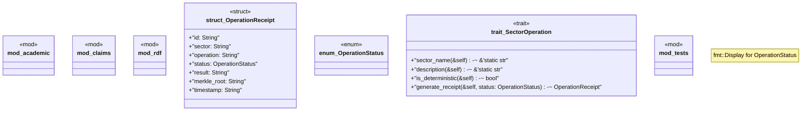

# `crates/chicago-tdd-tools/src/sector_stacks/mod.rs`

Source SHA-256: `641fc08d4faa4c6747697c23d1b7b28b10d1186ff3370b014420c28297bf1c5f`

## Dependencies

- `serde::{Deserialize, Serialize}`
- `std::fmt`
- `super::*`

## Standing

- Structural parse: `ALIVE`
- Runtime behavior: `UNKNOWN`
