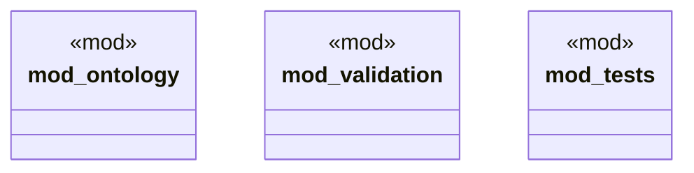

# `crates/chicago-tdd-tools/src/sector_stacks/rdf/mod.rs`

Source SHA-256: `1b71af0341d049233d4f12e17fdf835ae2a84b545d5538238652462435808ac5`

## Dependencies

- `ontology::{GuardConstraint, KnowledgeHook, SectorOntology, WorkflowStage}`
- `super::*`
- `validation::{RdfOperationValidator, RdfValidationError, RdfValidationResult}`

## Standing

- Structural parse: `ALIVE`
- Runtime behavior: `UNKNOWN`
