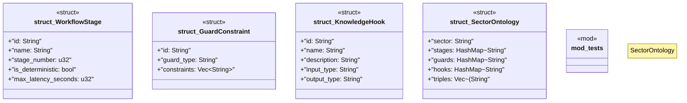

# `crates/chicago-tdd-tools/src/sector_stacks/rdf/ontology.rs`

Source SHA-256: `81f1a658fc29e3647480362bd33290e06dbc0b3e265228f904ae317437904a46`

## Dependencies

- `std::collections::HashMap`
- `super::*`

## Standing

- Structural parse: `ALIVE`
- Runtime behavior: `UNKNOWN`
