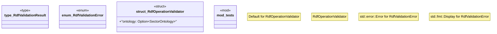

# `crates/chicago-tdd-tools/src/sector_stacks/rdf/validation.rs`

Source SHA-256: `92ab5db18dcd091891ce70feed45a2a476c713663e8a7cec570782653ca4ff4d`

## Dependencies

- `super::*`
- `super::ontology::{GuardConstraint, SectorOntology}`
- `super::super::ontology::WorkflowStage`

## Standing

- Structural parse: `ALIVE`
- Runtime behavior: `UNKNOWN`
