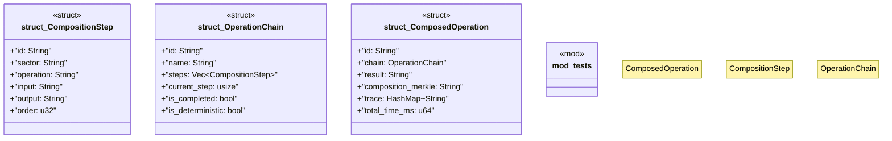

# `crates/chicago-tdd-tools/src/swarm/composition.rs`

Source SHA-256: `8eba68d66a8b9c262785a5f75791f5441848bac2768281a9feb7d3338a25c54e`

## Dependencies

- `serde::{Deserialize, Serialize}`
- `std::collections::HashMap`
- `super::*`

## Standing

- Structural parse: `ALIVE`
- Runtime behavior: `UNKNOWN`
