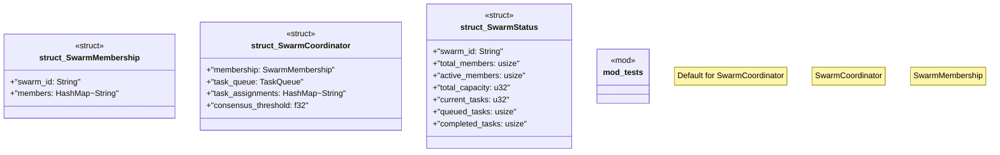

# `crates/chicago-tdd-tools/src/swarm/coordinator.rs`

Source SHA-256: `b477f8aa58ac166126c73e5034f478b1294d51dfd8ac5bd505b755cd2db61993`

## Dependencies

- `serde::{Deserialize, Serialize}`
- `std::collections::HashMap`
- `super::*`
- `super::member::SwarmMember`
- `super::task::{TaskQueue, TaskReceipt, TaskRequest}`

## Standing

- Structural parse: `ALIVE`
- Runtime behavior: `UNKNOWN`
