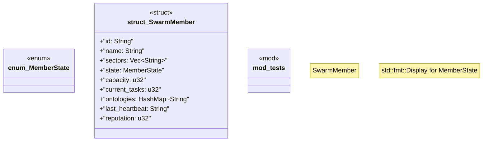

# `crates/chicago-tdd-tools/src/swarm/member.rs`

Source SHA-256: `07ec3aef7d020a4710b77b86edf08c43eb820318946a41167d82880e11e39257`

## Dependencies

- `serde::{Deserialize, Serialize}`
- `std::collections::HashMap`
- `super::*`

## Standing

- Structural parse: `ALIVE`
- Runtime behavior: `UNKNOWN`
