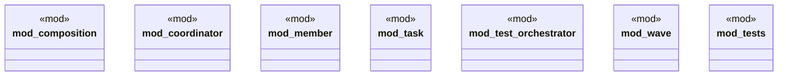

# `crates/chicago-tdd-tools/src/swarm/mod.rs`

Source SHA-256: `dd6d01d19f7c75f5f283f9dfb454915e679eb455c236e62b41122a41f68a49ed`

## Dependencies

- `composition::{ComposedOperation, OperationChain}`
- `coordinator::{SwarmCoordinator, SwarmMembership}`
- `member::SwarmMember`
- `super::*`
- `task::{TaskReceipt, TaskRequest, TaskStatus}`
- `test_orchestrator::{ QoSClass, ResourceBudget, TestOrchestrator, TestPlan, TestPlanningAPI, }`
- `wave::{ResidualClass, Wave, WavePhase, WaveReceipt, WaveStatus}`

## Standing

- Structural parse: `ALIVE`
- Runtime behavior: `UNKNOWN`
