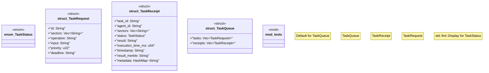

# `crates/chicago-tdd-tools/src/swarm/task.rs`

Source SHA-256: `a67c1bd3f58ec42eab046add2a52b91627270b21ec71350273643d3132b4d435`

## Dependencies

- `serde::{Deserialize, Serialize}`
- `std::collections::HashMap`
- `super::*`

## Standing

- Structural parse: `ALIVE`
- Runtime behavior: `UNKNOWN`
