# `crates/chicago-tdd-tools/src/swarm/test_orchestrator.rs`

Source SHA-256: `4f6d25a129a4565a68ba809b3499bd2565321d3b333470c31cb46f932b2abc0b`

```mermaid
classDiagram
    class struct_TestPlan {
      <<struct>>
      +"plan_id: String"
      +"contracts: Vec~String~"
      +"requester: String"
      +"priority: u8"
      +"qos: QoSClass"
      +"resource_budget: ResourceBudget"
      +"metadata: HashMap~String"
    }
    class enum_QoSClass {
      <<enum>>
    }
    class struct_ResourceBudget {
      <<struct>>
      +"max_cores: usize"
      +"max_memory_bytes: u64"
      +"max_wall_clock_seconds: u64"
      +"allow_network: bool"
      +"allow_storage: bool"
    }
    class struct_TestExecutionResult {
      <<struct>>
      +"plan_id: String"
      +"receipts: Vec~TestReceipt~"
      +"summary: ExecutionSummary"
    }
    class struct_ExecutionSummary {
      <<struct>>
      +"total_tests: usize"
      +"passed: usize"
      +"failed: usize"
      +"skipped: usize"
      +"total_wall_clock_ms: u64"
      +"total_ticks: u64"
    }
    class struct_TestOrchestrator {
      <<struct>>
      +"registry: TestContractRegistry"
      +"pending: VecDeque~TestPlan~"
      +"executed: Vec~TestExecutionResult~"
    }
    class struct_TestPlanningAPI {
      <<struct>>
      +"registry: TestContractRegistry"
    }
    class struct_CoverageGap {
      <<struct>>
      +"uncovered_modules: Vec~&'a str~"
      +"uncovered_invariants: Vec~&'a str~"
    }
    class mod_tests {
      <<mod>>
    }
    note "CoverageGap~"
    note "Default for ExecutionSummary"
    note "ExecutionSummary"
    note "ResourceBudget"
    note "TestOrchestrator"
    note "TestPlanningAPI"
```

## Dependencies

- `crate::core::contract::TestContract`
- `crate::core::contract::{TestContract, TestContractRegistry}`
- `crate::core::receipt::{TestOutcome, TestReceipt}`
- `serde::{Deserialize, Serialize}`
- `std::collections::{HashMap, VecDeque}`
- `super::*`

## Standing

- Structural parse: `ALIVE`
- Runtime behavior: `UNKNOWN`
