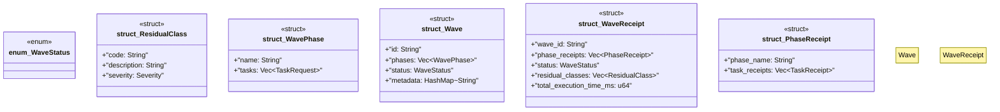

# `crates/chicago-tdd-tools/src/swarm/wave.rs`

Source SHA-256: `3e33c9b98c5b5967bae74dcbd4bef2e77a83099d40e67a7c07e34d7250522dbb`

## Dependencies

- `crate::core::governance::Severity`
- `crate::swarm::task::{TaskReceipt, TaskRequest}`
- `serde::{Deserialize, Serialize}`
- `std::collections::HashMap`

## Standing

- Structural parse: `ALIVE`
- Runtime behavior: `UNKNOWN`
