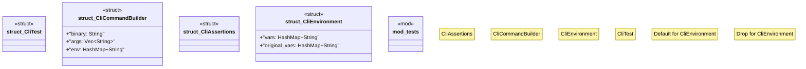

# `crates/chicago-tdd-tools/src/testing/cli.rs`

Source SHA-256: `fbdefde0c8619375816e43788dc37e6503010bb1f72e25b44a41cedff0530cbc`

## Dependencies

- `std::collections::HashMap`
- `super::{CliAssertions, CliCommandBuilder, CliEnvironment, CliTest}`
- `trycmd::TestCases`

## Standing

- Structural parse: `ALIVE`
- Runtime behavior: `UNKNOWN`
