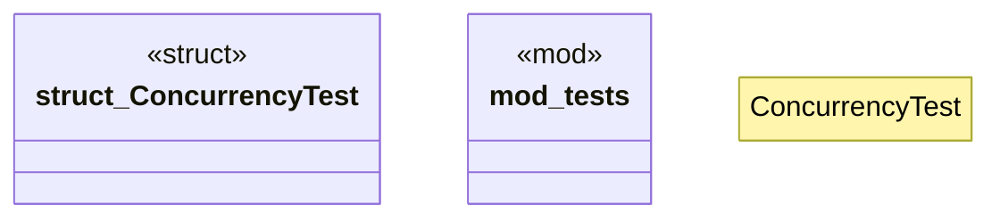

# `crates/chicago-tdd-tools/src/testing/concurrency.rs`

Source SHA-256: `ae1cfa3f31cc87e97f6f49cfefef89cc05c6cef2feaa654c4c27097929432660`

## Dependencies

- `loom::sync::{Arc, Mutex}`
- `loom::thread`
- `super::*`

## Standing

- Structural parse: `ALIVE`
- Runtime behavior: `UNKNOWN`
