# `crates/chicago-tdd-tools/src/testing/continuous_learning.rs`

Source SHA-256: `62d39629ef63e5a1d6d7bc418a281e9dc8c2f371dabc0eeb793bf978b91f551a`

```mermaid
classDiagram
    class struct_HistoryEntry {
      <<struct>>
      +"contract_name: String"
      +"modules: Vec~String~"
      +"ticks: u64"
      +"outcome: TestOutcome"
      +"timestamp: u64"
    }
    class struct_LearnedPattern {
      <<struct>>
      +"id: String"
      +"modules: Vec~String~"
      +"average_tau: f64"
      +"failure_rate: f64"
      +"observations: usize"
      +"confidence: f64"
    }
    class struct_TestPrediction {
      <<struct>>
      +"contract_name: String"
      +"failure_probability: f64"
      +"predicted_tau: u64"
      +"confidence: f64"
      +"recommendation: Recommendation"
    }
    class enum_Recommendation {
      <<enum>>
    }
    class struct_ContinuousLearner {
      <<struct>>
      +"history: Vec~HistoryEntry~"
      +"patterns: HashMap~String"
      +"timestamp: u64"
      +"min_observations: usize"
    }
    class struct_AdaptiveTestSelector {
      <<struct>>
      +"learner: ContinuousLearner"
      +"max_tests: usize"
      +"min_failure_prob: f64"
    }
    class mod_tests {
      <<mod>>
    }
    note "AdaptiveTestSelector"
    note "ContinuousLearner"
    note "Default for ContinuousLearner"
```

## Dependencies

- `crate::core::contract::TestContract`
- `crate::core::receipt::TimingMeasurement`
- `crate::core::receipt::{TestOutcome, TestReceipt}`
- `std::collections::HashMap`
- `super::*`

## Standing

- Structural parse: `ALIVE`
- Runtime behavior: `UNKNOWN`
