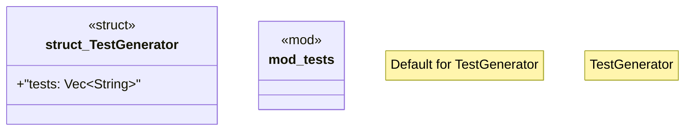

# `crates/chicago-tdd-tools/src/testing/generator.rs`

Source SHA-256: `af3c79bc37fff93c02adab3cce79c8b40d85ec851c27ee1fb82f162aa3506e0d`

## Dependencies

- `super::*`

## Standing

- Structural parse: `ALIVE`
- Runtime behavior: `UNKNOWN`
