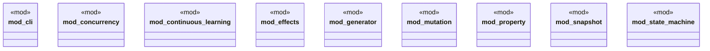

# `crates/chicago-tdd-tools/src/testing/mod.rs`

Source SHA-256: `94b25a4b7e330de63f3fd1ef83f58334b8096e0b94d259e7a57d8e496c723ee6`

## Dependencies

- `cli::*`
- `concurrency::*`
- `continuous_learning::*`
- `effects::*`
- `generator::*`
- `mutation::*`
- `property::*`
- `snapshot::*`
- `state_machine::*`

## Standing

- Structural parse: `ALIVE`
- Runtime behavior: `UNKNOWN`
