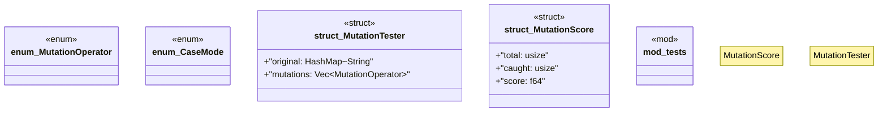

# `crates/chicago-tdd-tools/src/testing/mutation.rs`

Source SHA-256: `51102f7ce1c0a6760a639d71a294503344dc611e67cb6e190d09f5264e260190`

## Dependencies

- `std::collections::HashMap`
- `super::*`

## Standing

- Structural parse: `ALIVE`
- Runtime behavior: `UNKNOWN`
