# `crates/chicago-tdd-tools/src/testing/property.rs`

Source SHA-256: `6c7ce50f38a04711ab6e308f5d408847820f0b78e87c6c6a97497daf85ba2121`

```mermaid
classDiagram
    class struct_PropertyTestGenerator {
      <<struct>>
      +"seed: u64"
    }
    class struct_SimpleRng {
      <<struct>>
      +"state: u64"
    }
    class fn_property_all_data_valid {
      <<fn>>
    }
    class struct_ProptestStrategy {
      <<struct>>
      +"config: Config"
      +"seed: Option~[u8; 32]~"
    }
    class mod_property_tests {
      <<mod>>
    }
    class mod_proptest_tests {
      <<mod>>
    }
    note "Default for PropertyTestGenerator~MAX_ITEMS"
    note "Default for ProptestStrategy"
    note "PropertyTestGenerator~MAX_ITEMS"
    note "ProptestStrategy"
    note "SimpleRng"
```

## Dependencies

- `proptest::prelude::*`
- `proptest::test_runner::{Config, TestRunner}`
- `proptest::test_runner::{RngAlgorithm, TestRng}`
- `std::collections::HashMap`
- `super::*`

## Standing

- Structural parse: `ALIVE`
- Runtime behavior: `UNKNOWN`
