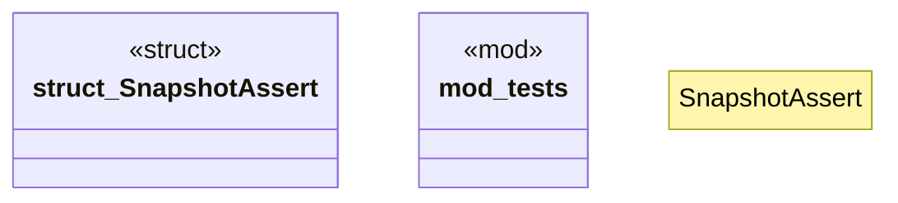

# `crates/chicago-tdd-tools/src/testing/snapshot.rs`

Source SHA-256: `4aab19ade3db22a82c266b2375b0321a9dfe13f71c4f2e5cc3968a6543f27ad8`

## Dependencies

- `insta::{assert_debug_snapshot, assert_snapshot, Settings}`
- `std::collections::BTreeMap`
- `std::collections::HashMap`
- `super::*`

## Standing

- Structural parse: `ALIVE`
- Runtime behavior: `UNKNOWN`
